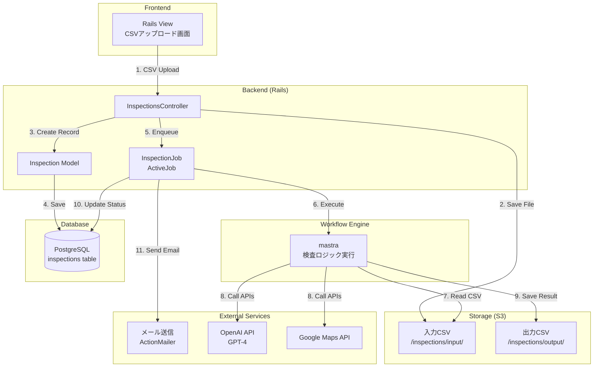
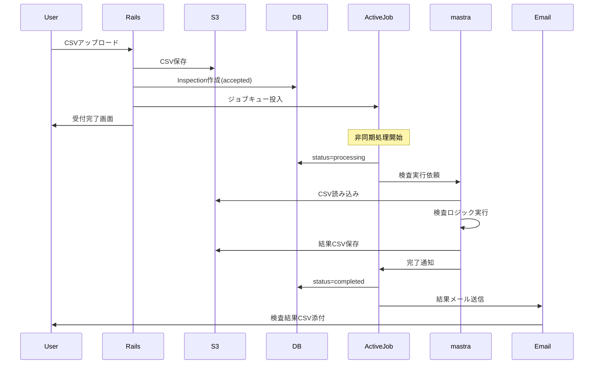

# システムアーキテクチャ設計

## 1. 全体構成図



## 2. データフロー詳細

### 2.1 ファイル保存構造（S3）

```
s3://expense-inspect-bucket/
├── inspections/
│   └── {inspection_id}/
│       ├── input/
│       │   └── {timestamp}_{original_filename}.csv
│       └── output/
│           └── expense_inspect_{timestamp}.csv
└── logs/
    └── access/
        └── {year}/{month}/
            └── access_{date}.log
```

例:
```
/inspections/
  └── 550e8400-e29b-41d4-a716-446655440000/
      ├── input/
      │   └── 20250107_143000_expense_202501.csv
      └── output/
          └── expense_inspect_20250107_143015.csv
```

### 2.2 ジョブ状態管理

```ruby
# Inspectionモデルのステータス遷移
accepted    # 受付完了
processing  # 検査実行中
completed   # 正常完了
failed      # エラー終了
```

## 3. 処理シーケンス



## 4. エラーハンドリング

### 4.1 システムレベルエラー
- CSV形式不正 → 即座にエラー画面表示
- S3保存失敗 → リトライ後、エラーメール送信
- DB保存失敗 → エラー画面表示

### 4.2 検査処理エラー
- 個別行エラー → 処理継続、結果CSVに記載
- API制限 → リトライ後、部分的な結果を返す
- 全体エラー → status=failed、エラーメール送信

## 5. セキュリティ考慮事項

### 5.1 アクセス制御
```ruby
# S3バケットポリシー
- 入力CSV: 実行ユーザーのみ読み取り可能
- 出力CSV: 実行ユーザーのみ読み取り可能
- 5年後自動削除（ライフサイクルルール）
```

### 5.2 ログ記録
```ruby
# アクセスログ（10年保存）
{
  timestamp: "2025-01-07T14:30:00Z",
  user_id: "12345",
  action: "upload",
  file_name: "expense_202501.csv",
  ip_address: "192.168.1.1",
  status: "success"
}
```

## 6. 技術スタック詳細

### 6.1 Rails側
- **ActiveJob**: Sidekiq または Delayed Job
- **ActiveStorage**: S3連携
- **ActionMailer**: メール送信

### 6.2 mastra統合
```ruby
# 想定される統合方法
class InspectionWorkflow < Mastra::Workflow
  step :load_csv
  step :validate_data
  step :inspect_taxi
  step :inspect_alcohol
  step :inspect_duplicate
  step :generate_report
end
```

## 7. 今後の検討事項

1. **mastraとRailsの連携方法**
   - HTTPベース？直接呼び出し？
   - エラー時の通信方法

2. **パフォーマンス最適化**
   - 大量CSV（30,000行）の処理
   - 並列処理の実装方法

3. **監視・ログ**
   - CloudWatch連携
   - エラー通知の実装（Slack等）
