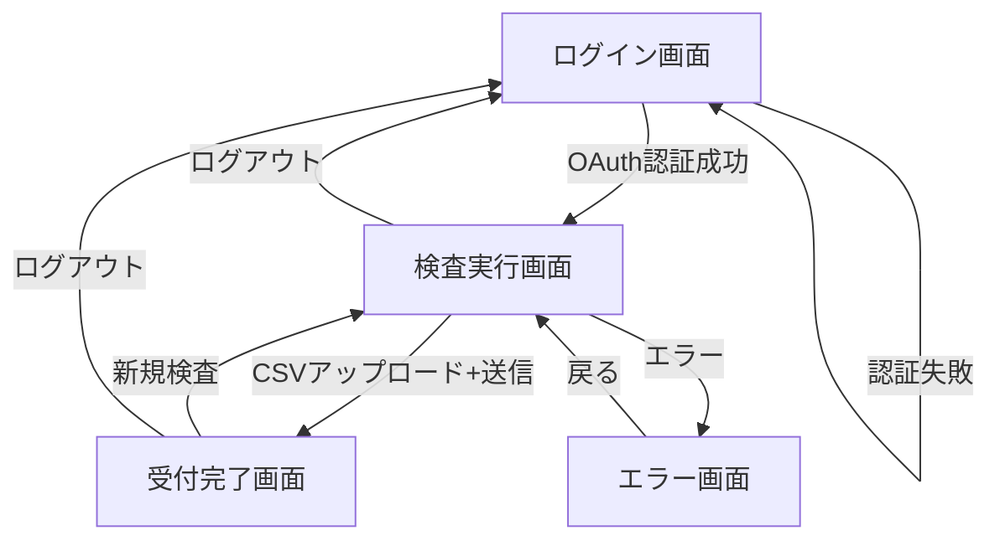

# 画面設計

## 1. 画面遷移図



## 2. 画面詳細

### 2.1 ログイン画面 (/login)

```
┌─────────────────────────────────────────────────┐
│                                                 │
│           TOKIUM AI 経費検査システム              │
│                                                 │
│                    ロゴ画像                      │
│                                                 │
│       ┌─────────────────────────────┐          │
│       │   TOKIUMアカウントでログイン   │          │
│       └─────────────────────────────┘          │
│                                                 │
│         OAuth2.0でセキュアにログイン             │
│                                                 │
└─────────────────────────────────────────────────┘
```

### 2.2 検査実行画面 (/inspections/new)

```
┌─────────────────────────────────────────────────┐
│ ヘッダー                                         │
│ ┌─────────────────────────────────────────┐   │
│ │ TOKIUM AI 経費検査  ユーザー名 ログアウト │   │
│ └─────────────────────────────────────────┘   │
│                                                 │
│ メインコンテンツ                                 │
│ ┌─────────────────────────────────────────┐   │
│ │ 経費データ検査                            │   │
│ │                                          │   │
│ │ 1. CSVファイルを選択                      │   │
│ │ ┌────────────────────────────────────┐  │   │
│ │ │                                    │  │   │
│ │ │  ファイルをドラッグ&ドロップ         │  │   │
│ │ │          または                    │  │   │
│ │ │  [ファイルを選択]                  │  │   │
│ │ │                                    │  │   │
│ │ └────────────────────────────────────┘  │   │
│ │  選択中: expense_202501.csv (2.3MB)      │   │
│ │                                          │   │
│ │ 2. 結果送信先メールアドレス               │   │
│ │ ┌────────────────────────────────────┐  │   │
│ │ │ user@example.com                  │  │   │
│ │ └────────────────────────────────────┘  │   │
│ │ [+ メールアドレスを追加]                  │   │
│ │                                          │   │
│ │ ┌────────────────┐ ┌────────────────┐  │   │
│ │ │   検査開始     │ │  サンプルCSV   │  │   │
│ │ └────────────────┘ └────────────────┘  │   │
│ │                                          │   │
│ │ 注意事項:                                │   │
│ │ ・TOKIUM経費精算の「経費詳細」形式のみ対応  │   │
│ │ ・処理完了まで5-10分程度かかります        │   │
│ │ ・最大5,000行まで処理可能                │   │
│ └─────────────────────────────────────────┘   │
└─────────────────────────────────────────────────┘
```

### 2.3 受付完了画面 (/inspections/{id}/accepted)

```
┌─────────────────────────────────────────────────┐
│ ヘッダー（同上）                                 │
│                                                 │
│ ┌─────────────────────────────────────────┐   │
│ │         ✓ 検査を受け付けました             │   │
│ │                                          │   │
│ │ 検査ID: 550e8400-e29b-41d4-a716-44665...  │   │
│ │                                          │   │
│ │ 検査が完了次第、以下のアドレスに           │   │
│ │ 結果をお送りします：                       │   │
│ │                                          │   │
│ │ ・user@example.com                       │   │
│ │ ・manager@example.com                    │   │
│ │                                          │   │
│ │ 処理には通常5-10分程度かかります。         │   │
│ │                                          │   │
│ │ ┌────────────────────┐                  │   │
│ │ │   新規検査を開始    │                  │   │
│ │ └────────────────────┘                  │   │
│ └─────────────────────────────────────────┘   │
└─────────────────────────────────────────────────┘
```

### 2.4 エラー画面

```
┌─────────────────────────────────────────────────┐
│ ヘッダー（同上）                                 │
│                                                 │
│ ┌─────────────────────────────────────────┐   │
│ │         ⚠ エラーが発生しました             │   │
│ │                                          │   │
│ │ CSVファイルの形式が正しくありません。       │   │
│ │                                          │   │
│ │ エラー詳細:                              │   │
│ │ 必須列「申請者名」が見つかりません。       │   │
│ │                                          │   │
│ │ TOKIUM経費精算の「経費詳細」形式で         │   │
│ │ エクスポートされたCSVファイルを           │   │
│ │ ご使用ください。                          │   │
│ │                                          │   │
│ │ ┌────────────────┐                      │   │
│ │ │     戻る       │                      │   │
│ │ └────────────────┘                      │   │
│ └─────────────────────────────────────────┘   │
└─────────────────────────────────────────────────┘
```

## 3. UIコンポーネント仕様

### 3.1 ファイルアップロード
- **形式**: ドラッグ&ドロップ対応
- **制限**: 
  - CSVファイルのみ
  - 最大10MB
  - UTF-8 BOM付き/なし両対応
- **プレビュー**: ファイル名とサイズを表示

### 3.2 メールアドレス入力
- **複数入力**: 動的に入力欄追加
- **バリデーション**: 
  - メール形式チェック
  - 最大10アドレスまで
- **削除機能**: 各アドレスに削除ボタン

### 3.3 レスポンシブ対応
- **PC**: 最大幅1200px、中央寄せ
- **タブレット**: パディング調整
- **スマホ**: 縦積みレイアウト

## 4. 画面フロー詳細

### 4.1 正常フロー
1. TOKIUMアカウントでログイン
2. CSVファイル選択
3. メールアドレス入力（複数可）
4. 検査開始ボタンクリック
5. 受付完了画面表示
6. （バックグラウンドで検査実行）
7. メールで結果受信

### 4.2 エラーパターン
- **ファイル未選択**: ボタン非活性
- **メール未入力**: エラーメッセージ表示
- **CSV形式エラー**: エラー画面へ遷移
- **サーバーエラー**: エラー画面へ遷移

## 5. 実装上の考慮点

### 5.1 フロントエンド
- Rails標準のViewで実装（Phase2）
- JavaScript不要のシンプルな構成
- 標準的なHTMLフォームで実現

### 5.2 バックエンド連携
- CSVアップロード: multipart/form-data
- CSRF対策: Railsトークン使用
- セッション管理: OAuthトークン保持

### 5.3 将来の拡張性
- React/Next.jsへの移行を考慮
- API設計は RESTful に
- 履歴画面の追加スペース確保