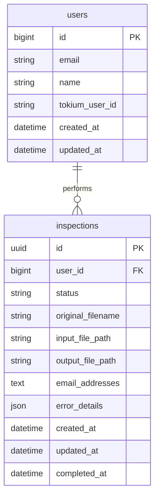

# データベース設計

## 1. ER図



## 2. テーブル詳細

### 2.1 inspections（検査テーブル）

| カラム名 | 型 | 制約 | 説明 |
|---------|-----|------|------|
| id | uuid | PRIMARY KEY | 検査ID（UUID v4） |
| user_id | bigint | NOT NULL, FK | 実行ユーザーID |
| status | string | NOT NULL | ステータス（accepted/processing/completed/failed） |
| original_filename | string | NOT NULL | アップロードされたファイル名 |
| input_file_path | string | NOT NULL | S3上の入力ファイルパス |
| output_file_path | string | | S3上の出力ファイルパス |
| email_addresses | text | NOT NULL | 送信先メールアドレス（カンマ区切り） |
| error_details | json | | エラー詳細（エラー時のみ） |
| created_at | datetime | NOT NULL | 作成日時 |
| updated_at | datetime | NOT NULL | 更新日時 |
| completed_at | datetime | | 完了日時 |

### 2.2 users（ユーザーテーブル）

| カラム名 | 型 | 制約 | 説明 |
|---------|-----|------|------|
| id | bigint | PRIMARY KEY | ユーザーID |
| email | string | NOT NULL, UNIQUE | メールアドレス |
| name | string | | 氏名 |
| tokium_user_id | string | NOT NULL, UNIQUE | TOKIUM側のユーザーID |
| created_at | datetime | NOT NULL | 作成日時 |
| updated_at | datetime | NOT NULL | 更新日時 |

## 3. インデックス

```sql
-- inspections
CREATE INDEX idx_inspections_user_id ON inspections(user_id);
CREATE INDEX idx_inspections_status ON inspections(status);
CREATE INDEX idx_inspections_created_at ON inspections(created_at);

-- users
CREATE UNIQUE INDEX idx_users_email ON users(email);
CREATE UNIQUE INDEX idx_users_tokium_user_id ON users(tokium_user_id);
```

## 4. 実装例（Rails Migration）

```ruby
# db/migrate/001_create_users.rb
class CreateUsers < ActiveRecord::Migration[7.0]
  def change
    create_table :users do |t|
      t.string :email, null: false
      t.string :name
      t.string :tokium_user_id, null: false
      t.timestamps
    end

    add_index :users, :email, unique: true
    add_index :users, :tokium_user_id, unique: true
  end
end

# db/migrate/002_create_inspections.rb
class CreateInspections < ActiveRecord::Migration[7.0]
  def change
    enable_extension 'pgcrypto' # UUID生成用

    create_table :inspections, id: :uuid do |t|
      t.references :user, null: false, foreign_key: true
      t.string :status, null: false, default: 'accepted'
      t.string :original_filename, null: false
      t.string :input_file_path, null: false
      t.string :output_file_path
      t.text :email_addresses, null: false
      t.json :error_details
      t.datetime :completed_at
      t.timestamps
    end

    add_index :inspections, :status
    add_index :inspections, :created_at
  end
end
```

## 5. モデル定義例

```ruby
# app/models/user.rb
class User < ApplicationRecord
  has_many :inspections

  validates :email, presence: true, uniqueness: true
  validates :tokium_user_id, presence: true, uniqueness: true
end

# app/models/inspection.rb
class Inspection < ApplicationRecord
  belongs_to :user

  STATUSES = %w[accepted processing completed failed].freeze

  validates :status, inclusion: { in: STATUSES }
  validates :original_filename, presence: true
  validates :input_file_path, presence: true
  validates :email_addresses, presence: true

  def email_addresses_array
    email_addresses.split(',').map(&:strip)
  end
end
```

## 6. 設計上の考慮点

### 6.1 UUID採用の理由
- 外部に公開してもセキュア
- URLに含めても推測されにくい
- 分散システムでの生成が可能

### 6.2 email_addressesをテキスト型にした理由
- 別テーブルにするほど複雑ではない
- カンマ区切りで十分シンプル
- 検索要件がない

### 6.3 error_detailsをJSON型にした理由
- エラー内容が多様
- 構造化されたエラー情報を保存
- PostgreSQLのJSON機能を活用

## 7. 将来の拡張性

### 7.1 監査ログ
auditedライブラリとの連携を考慮：
```ruby
class Inspection < ApplicationRecord
  audited # 変更履歴を自動記録
end
```

### 7.2 検査詳細テーブル
将来的に個別行の検査結果を保存する場合：
```ruby
# inspection_results テーブル
# - inspection_id
# - row_number
# - taxi_result
# - alcohol_result
# - duplicate_result
```
