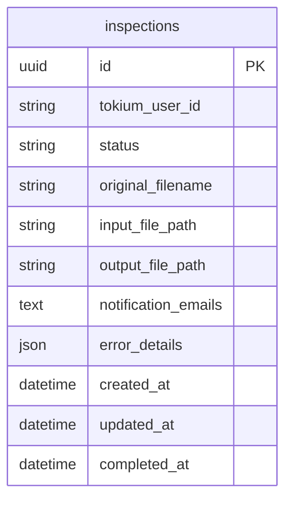

# データベース設計（MVP版）

## 1. ER図



注：
- Userテーブルは作成しない
- tokium_user_idはMVP時は固定値（例："test-user-001"）、OAuth2実装後は実際のID

## 2. MVP段階での簡略化

### 2.1 認証なしの実装
```ruby
# app/controllers/application_controller.rb
class ApplicationController < ActionController::Base
  private
  
  def current_user
    # MVP用の固定ユーザー
    OpenStruct.new(
      id: "test-user-001",  # 固定のuser_id
      email: "test@example.com",
      name: "テストユーザー"
    )
  end
end
```

### 2.2 inspectionsテーブル

| カラム名 | 型 | 制約 | 説明 |
|---------|-----|------|------|
| id | uuid | PRIMARY KEY | 検査ID |
| tokium_user_id | string | NOT NULL | TOKIUMユーザーID |
| status | string | NOT NULL | ステータス |
| original_filename | string | NOT NULL | アップロードファイル名 |
| input_file_path | string | NOT NULL | S3入力パス |
| output_file_path | string | | S3出力パス |
| notification_emails | text | NOT NULL | 結果通知先メール（カンマ区切り） |
| error_details | json | | エラー詳細 |
| completed_at | datetime | | 完了日時 |
| created_at | datetime | NOT NULL | 作成日時 |
| updated_at | datetime | NOT NULL | 更新日時 |

## 3. OAuth2移行時の変更点

### 3.1 最小限の変更で済む理由

1. **コントローラー層**
   ```ruby
   def current_user
     # OAuth2実装後
     @current_user ||= OpenStruct.new(
       id: session[:tokium_user_id],  # TOKIUMのuser_id
       email: session[:user_email],    # 表示用（変更される可能性あり）
       name: session[:user_name]       # 表示用（変更される可能性あり）
     )
   end
   ```

2. **データベース層**
   - tokium_user_idに実際のIDを保存するように変更
   - カラム名は同じなので、スキーマ変更不要

3. **ビュー層**
   - 変更なし（`current_user`を使うだけ）

## 4. MVP実装例

### 4.1 マイグレーション

```ruby
# db/migrate/001_create_inspections.rb
class CreateInspections < ActiveRecord::Migration[7.0]
  def change
    enable_extension 'pgcrypto'

    create_table :inspections, id: :uuid do |t|
      t.string :tokium_user_id, null: false
      t.string :status, null: false, default: 'accepted'
      t.string :original_filename, null: false
      t.string :input_file_path, null: false
      t.string :output_file_path
      t.text :notification_emails, null: false
      t.json :error_details
      t.datetime :completed_at
      t.timestamps
    end

    add_index :inspections, :status
    add_index :inspections, :created_at
    add_index :inspections, :tokium_user_id
  end
end
```

### 4.2 モデル定義

```ruby
# app/models/inspection.rb
class Inspection < ApplicationRecord
  STATUSES = %w[accepted processing completed failed].freeze

  validates :status, inclusion: { in: STATUSES }
  validates :tokium_user_id, presence: true
  validates :original_filename, presence: true
  validates :input_file_path, presence: true
  validates :notification_emails, presence: true

  def notification_emails_array
    notification_emails.split(',').map(&:strip)
  end
end
```

### 4.3 コントローラー実装例

```ruby
# app/controllers/inspections_controller.rb
class InspectionsController < ApplicationController
  def create
    @inspection = Inspection.new(inspection_params)
    @inspection.tokium_user_id = current_user.id  # MVP: "test-user-001", OAuth2後: 実際のID
    
    if @inspection.save
      InspectionJob.perform_later(@inspection)
      redirect_to accepted_inspection_path(@inspection)
    else
      render :new
    end
  end
  
  private
  
  def inspection_params
    params.require(:inspection).permit(:csv_file, :notification_emails)
  end
end
```

## 5. 開発の進め方

### Phase 1: MVP（技術検証）
1. 固定ユーザーで実装
2. mastraとの連携を検証
3. 基本的な検査フローを確立

### Phase 2: OAuth2統合
1. tokium_user_idカラムを追加
2. current_userメソッドを更新
3. TOKIUM APIとの連携実装

この設計により、MVP開発に集中しながら、将来のOAuth2移行もスムーズに行えます。